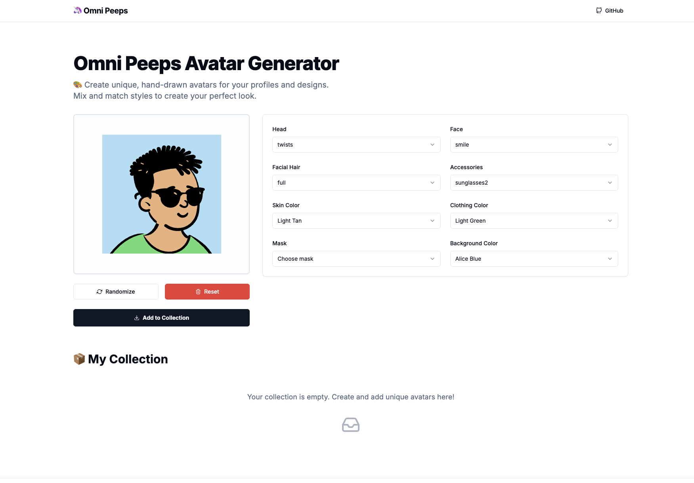

# 🦄 Omni Peeps Avatar Generator

A delightful React application for generating and customizing unique, hand-drawn avatars using the [Open Peeps](https://www.openpeeps.com/) library by Pablo Stanley.



## ✨ Features

- **🎨  Full Customization**: Fine-tune every aspect of your avatar, including head, face, facial hair, accessories, skin color, and clothing.
- **🎲  Randomize**: Feeling lucky? Generate a completely random avatar with a single click.
- **📚  Collections**: Save your favorite creations to a local collection for easy access.
- **✏️  Edit & Update**: Tweak your saved avatars anytime.
- **💾  Export**: Download your avatars as high-quality PNG images.
- **🔗  Share**: Copy direct links to your generated avatars.
- **⚡  Fast & Responsive**: Built with Vite and React for a snappy user experience.

## 🛠️ Tech Stack

- **Framework**: [React](https://reactjs.org/) + [Vite](https://vitejs.dev/)
- **Language**: [TypeScript](https://www.typescriptlang.org/)
- **Styling**: [Tailwind CSS](https://tailwindcss.com/)
- **UI Components**: [Shadcn UI](https://ui.shadcn.com/) (based on [Radix UI](https://www.radix-ui.com/))
- **Form Management**: [React Hook Form](https://react-hook-form.com/)
- **Icons**: [React Icons](https://react-icons.github.io/react-icons/) & [Lucide React](https://lucide.dev/)
- **Avatar Library**: [DiceBear Open Peeps](https://www.dicebear.com/styles/open-peeps/)

## 🚀 Getting Started

### Prerequisites

- Node.js (v18 or higher)
- npm or yarn

### Installation

1.  **Clone the repository**

    ```bash
    git clone https://github.com/adarshajit/omni-peeps.git
    cd omni-peeps
    ```

2.  **Install dependencies**

    ```bash
    npm install
    ```

3.  **Start the development server**

    ```bash
    npm run dev
    ```

    The app should now be running at `http://localhost:5173`.

### Building for Production

```bash
npm run build
```

## 🤝 Contributing

Contributions are welcome! Please feel free to submit a Pull Request.

## 📄 License

This project is licensed under the MIT License.

## 🙏 Credits

- **[Open Peeps](https://www.openpeeps.com/)** by [Pablo Stanley](https://twitter.com/pablostanley) for the amazing hand-drawn illustrations.
- **[DiceBear](https://www.dicebear.com/)** for the avatar generation API.